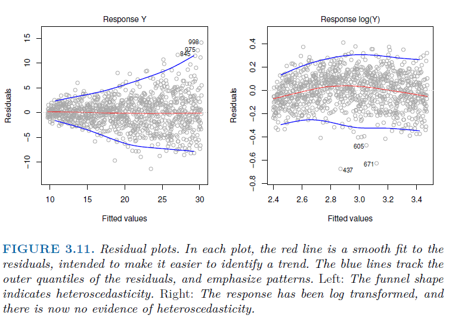
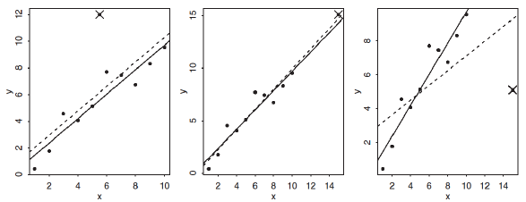

```{r setup, include=FALSE}
knitr::opts_chunk$set(warning=FALSE, message=FALSE, echo = T)
```

```{css, echo=FALSE}
h2 {
  color: #ff0000
}
```

```{r include=FALSE}
library(tidyverse)
library(janitor)
library(GGally)
library(kableExtra)
library(sjPlot)
library(scatterplot3d)
library(gridExtra)
```

```{r include=FALSE}
df = read_csv("samp_nhanes.csv")
set.seed(1)
df = sample_n(df, 50)
```

Today, we explore Chapter 3: "Linear Regression" from the book *Introduction to Statistical Learning*. We will use R for the purposes of this session.

## Simple Linear Regression

-   Predicts quantitative response $Y$ on the basis of a single predictor variable $X$

-   Assumes linear relationship between $X$ and $Y$

$$Y \approx \beta_0 + \beta_1 X$$

Model parameters (or coefficients):

-   $\beta_0$ : intercept

-   $\beta_1$ : slope

We estimate these with our training data, and can predict future values of our response variable.

$$\hat y = \hat \beta_0 + \hat \beta_1 x$$

where $\hat y$ is our prediction of $Y$ on the basis that $X = x$ and $\hat \beta_0$, $\hat \beta_1$ are our estimates for the true parameters.

### Estimating the Coefficients

How do we estimate the coefficients? Let's use health data for our example. We pulled a random sample of 50 individuals from the **National Health and Nutrition Examination Survey (NHANES)**. Below is a scatter plot of their systolic vs. diastolic blood pressure.

```{r fig.align = "center", out.width="70%"}
df %>% ggplot(aes(x = bp_di, y = bp_sys)) +
  geom_point(size = 1.5) +
#  geom_smooth(method = "lm") +
  theme_bw() +
  labs(x = "Blood Pressure: Diastolic (mmHg)", y = "Blood Pressure: Systolic (mmHg)", title = "Systolic vs. Diastolic Blood Pressure")
```

If we believe a linear relationship exists between these two variables, we desire to obtain a line of *best fit* that is *close* to our data. How do we measure "closeness"? The most common approach is to minimize the *least squares* criterion.

Let $\hat y_i = \hat \beta_0 + \hat \beta_1 x_i$ be the prediction for $Y$ based on the $i$th value of $X$. Then $e_i = y_i - \hat y_i$ represents the $i$th residual (difference between each observed and predicted value). We define the *residual sum of squares* (RSS) as

$$\text{RSS} = e_1^2 + e_2^2 + \cdots + e_n^2$$

The *least squares* approach chooses $\hat \beta_0$ and $\hat \beta_1$ to minimize RSS.

```{r}
lrmod = df %>% lm(bp_sys ~ bp_di, data = .)
```

```{r warning = F, message = F, fig.align = "center", out.width="70%"}
lrmod %>% fortify(lrmod$model) %>% ggplot(aes(x = bp_di, y = bp_sys)) +
  geom_point(size = 1.5) +
  geom_smooth(aes(y = .fitted), method = "lm") +
  geom_segment(aes(xend = bp_di, yend = .fitted, color = "resid")) +
  theme_bw() +
  labs(x = "Blood Pressure: Diastolic (mmHg)", y = "Blood Pressure: Systolic (mmHg)", title = "Systolic vs. Diastolic Blood Pressure") +
  theme(legend.position = "none")
```

The above blue line represents the line that *minimizes* the sum of the squared residuals. In other words, each red line represents the distance between the predicted and actual observed value. We add up each of those squared distances. In the above chart, the blue line produces an $RSS = 12768.4$. It's important to note that this distance is in terms of squared units, or *mmHg*$^2$ . The actual value is somewhat meaningless, but we can be confident that it is the lowest **RSS** that any line could produce.

Speaking of the line, what were our estimates? Below are the estimates along with an appropriate interpretation:

$\hat \beta_1 = 0.738$: Every 1 unit (mmHg) increase in diastolic blood pressure is associated with a 0.738 increase in systolic blood pressure

\
What about our intercept term?\
$\hat \beta_0 = 72.02$: For someone with a value of 0 for diastolic blood pressure, our model predicts a systolic blood pressure of 72.02.

Note that this nonsensical prediction is common for intercept terms. The estimated intercept is necessary to produce a line, but is often not useful or does not produce a logical interpretation.

### Assessing the Accuracy of the Coefficient Estimates

Recall from last session that we assume the true relationship between $X$ and $Y$ takes the form $Y = f(X) + \epsilon$ where $\epsilon$ is a mean-zero random error term. Our assumed linear relationship can then be written as $Y = \beta_0 + \beta_1 X + \epsilon$. The error term is a catch-all for what we miss with the simple model. We assume:

-   $\epsilon$ is independent of $X$

-   errors $\epsilon_i$ have common variance $\sigma^2$ and are uncorrelated

In general, $\sigma^2$ is not known, but can be estimated from the data. This estimate, $\sigma$, is also called the *residual standard error*, and is given by the formula $RSE = \sqrt{RSS/(n-2)}$.

#### Confidence Intervals

Another error we care about is *Standard Error* of the individual estimates. We recognize that our estimates have a certain level of uncertainty. There are formulas we use to approximate the standard errors, but we will not cover these in this setting.

We can compute 95% confidence intervals for our estimates of the coefficients using the formula:

$$
\hat \beta_1 \pm 2 \cdot SE(\hat \beta_1)
$$ where $SE(\hat \beta_1)$ is the standard error of our estimate. Of note, the "2" in this case is an approximate value that sets our confidence level for our confidence interval. This value will change depending on the degrees of freedom (i.e., sample size - \# of predictors).

#### Hypothesis Testing

In a similar manner, the standard errors can be used in hypothesis testing. For each estimate in linear regression, we are hypothesizing the following:

-   $H_0: \beta_1 = 0$ : There is no relationship between $X$ and $Y$

-   $H_A: \beta_1 \neq 0$ : There is some relationship between $X$ and $Y$

In order to test this hypothesis, we need to determine how far $\hat \beta_1$ is from 0 so that we can be confident it is non-zero. We compute a *t-statistic* through the formula:

$$
t = \frac{\hat \beta_1 - 0}{SE(\hat \beta_1)}
$$

Each value of $t$ indicates the number of standard deviations our estimate ($\hat \beta_1$) is away from our null-hypothesized value for $\hat \beta_1$ , which is 0. Once we have $t$, we can compute a $p$-value. This corresponds to the area under the curve of a standard $t$-distribution (bell-shaped curve similar to the standard normal distribution) that lies larger than the $|t|$ . This area ($p$-value) is the probability that we would obtain a value greater than or equal to $|t|$ given that the null hypothesis is true (that $\beta_1$ = 0). Another way to think about this is the probability that we observe a relationship due to random chance.

A small $p$-value indicates that it is unlikely we would obtain something like our estimate due to chance if there is no association between $X$ and $Y$. In such cases, we would reject the null hypothesis ($H_0: \beta_1 = 0$ ) in favor of the alternative ($H_A: \beta_1 \neq 0$).

For our example, linear regression output produces the below table:

```{r}
tab3.1 = summary(lrmod)$coef %>% kbl(digits = 4, caption = "Table 3.1 Simple Regression of Systolic vs. Diastolic", table.attr = "style = 'width:70%;'") %>%  kable_classic(full_width = T) 
tab3.1
```

Notice the *Estimate* column contains the estimates for $\beta_0$ and $\beta_1$ . Also included are their corresponding standard errors, $t$-statistics, and $p$-values. For $\beta_1$, we can be confident that the estimate is not 0 given the small $p$-value associated with it ($p$-value = 0.0013). Typically, we consider our estimate to be statistically significant (i.e., different than 0) if our $p$-value is below 0.05.

### Assessing the Accuracy of the Model

There are several statistical measures to assess model accuracy. Our linear regression summary output provides three measures: $RSE$ , $R^2$ , and the $F$-statistic. For now we'll focus on the first two.

```{r }
rse = summary(lrmod)$sigma
r2 = summary(lrmod)$r.squared
fstat = summary(lrmod)$fstatistic[1]
tab3.2 = rbind(rse,r2,fstat)
row.names(tab3.2) = c("Residual Standard Error","R\u00b2","F-Statistic")
tab3.2 %>% kbl(digits = 3, caption = "Table 3.2 SLR Model Accuracy Measures", table.attr = "style = 'width:50%;'") %>%  kable_classic(full_width = T)
```

Table 3.2 displays these three measures for our linear regression of systolic blood pressure on diastolic.

#### Residual Standard Error

Recall that each observation is associated with an error term $\epsilon$. Even if we knew the true $\beta_0$ and $\beta_1$, we could not perfectly predict $Y$ from $X$ due to these errors. The RSE is an *estimate* of the standard deviation of $\epsilon$. It is given by the formula:

$$RSE = \sqrt{\frac{1}{n-2}RSS} \qquad \text{ where } RSS = \sum_{i=1}^n(y_i - \hat y_i)^2$$Residual Sum of Squares (RSS) is the sum of the squared deviation of each predicted value from the observed value. In our example, the RSE is 16.31. One way to think about this is that even if the model were correct, any prediction of systolic from diastolic blood pressure would be off by about 16.31 units (mmHg) on average.

#### $R^2$ Statistic

While RSE provides an *absolute* measure lack of fit of the model to the data, $R^2$ provides an alternative measure.

-   Proportion of the variance explained

-   Takes on a value between 0 and 1

-   independent of the scale of $Y$

It is given by the formula:

$$
R^2 = \frac{TSS - RSS}{TSS} = 1 - \frac{RSS}{TSS} \qquad \text{ where } TSS = \sum_{i=1}^n (y_i - \bar y)^2
$$Here, TSS is the *total sum of squares*. Essentially, TSS is the sum of the squared residuals if we included no predictors and predicted $Y$ with $\bar y$. Alternatively, we can think of $\bar y$ being the best prediction for $Y$ if there was *no relationship* between $X$ and $Y$. $R^2$ shows us how much better our model does at explaining $Y$ by showing us how much $TSS$ is reduced or explained.

While a higher $R^2$ typically means our model explains a large proportion of the variance in $Y$, a lower $R^2$ value does not necessarily mean the model is wrong. It could mean that the error variance $\sigma^2$ is high. In different settings or applications, a single $R^2$ value could be considered good or bad. In most real-world applications (outside of physics where a linear relationship might be known), it is at best a rough approximation to the data.

In our example, $R^2$ was 0.196. We interpret this as 19.6% of the variation in $Y$ (systolic blood pressure) is explained using $X$ (diastolic blood pressure). It is also a measure of the linear relationship between $X$ and $Y$. In the Simple Linear Regression setting, $R^2 = r^2$, where $r = Cor(X,Y)$. This concept does not extend to Multiple Linear Regression, however, as we'll show in the next section.

## Multiple Linear Regression

Multiple Linear Regression enables us to predict a response with more than one predictor. In our example, we also have a measurement for **Body Mass Index (BMI)**. We could simply fit another simple linear regression for systolic blood pressure on BMI.

```{r}
lrmod2 = df %>% lm(bp_sys ~ bmi, data = .)
tab3.3 = summary(lrmod2)$coef %>% kbl(digits = 4, caption = "Table 3.3 Simple Regression of Systolic vs. BMI", table.attr = "style = 'width:70%;'") %>%  kable_classic(full_width = T)

tab3.1
tab3.3
```

Notice how both regressions produce statistically significant ($p$-value \< 0.05) estimates for their one predictor. In the second regression, each one unit ($kg/m^2$) increase in BMI is associated with a one unit (mmHg) increase in systolic blood pressure. However, each equation ignores the other predictor in forming estimates for the coefficients. This can be highly misleading.

Multiple Linear Regression can estimate a separate slope coefficient for each predictor in a single model. With $p$ distinct predictors, it takes the form:

$$
Y = \beta_0 + \beta_1 X_1 + \beta_2 X_2 + \cdots + \beta_p X_p + \epsilon
$$ We can interpret $\beta_1$ as the average effect on $Y$ for a one-unit increase in $X_1$, [**holding all other predictors fixed**]{.ul}. Let's fit a single model with both predictors.

$$
\widehat{BP}_{\text{systolic}} = \beta_0 + \beta_1 \times BP_\text{diastolic} + \beta_2 \times BMI + \epsilon
$$ The three parameters ($\beta_0$, $\beta_1$, and $\beta_2$) are estimated using the same least squares approach we saw in SLR. Note the new equation:

We fit the model below and show the results in Table 3.4, but let us first look visually at what this MLR is doing.

```{r warning = F, message = F, fig.align = "center", out.width="70%"}
lrmod3 = df %>% lm(bp_sys ~ bp_di + bmi, data = .)
Diastolic = df$bp_di
Systolic = df$bp_sys
BMI = df$bmi

G = scatterplot3d(Diastolic, BMI, Systolic, pch = 19, type = "p", color = "darkgrey",
                     main = "Regression Plane", grid = TRUE, box = FALSE,  
                     mar = c(2.5, 2.5, 2, 1.5), angle = 30)

# compute locations of segments
orig     <- G$xyz.convert(Diastolic, BMI, Systolic)
plane    <- G$xyz.convert(Diastolic, BMI, fitted(lrmod3))
i.negpos <- 1 + (resid(lrmod3) > 0) # which residuals are above the plane?

# draw residual distances to regression plane
segments(orig$x, orig$y, plane$x, plane$y, col = "red", lty = c(2, 1)[i.negpos], 
         lwd = 1.5)

G$plane3d(lrmod3, draw_polygon = TRUE, draw_lines = TRUE, 
            polygon_args = list(col = rgb(.1, .2, .7, .5)))

wh = resid(lrmod3) > 0
G$points3d(Diastolic[wh],BMI[wh],Systolic[wh],pch = 19)
segments(orig$x[wh], orig$y[wh], plane$x[wh], plane$y[wh], col = "red", lty = 1, lwd = 1.5)
```

The MLR fits the best *plane* that minimizes the RSS. Two quantitative predictors is the most we can visualize, but the basic concept extends to models with more than two. In such cases, we say our linear model fits the *hyperplane* that minimizes the RSS.

```{r}
tab3.4 = summary(lrmod3)$coef %>% kbl(digits = 4, caption = "Table 3.4 Multiple Regression of Systolic on Diastolic and BMI", table.attr = "style = 'width:70%;'") %>%  kable_classic(full_width = T)
tab3.4
```

Notice the difference between the estimates from the individual SLRs (Tables 3.1 and 3.3) compared to the estimates in Table 3.4. The estimates for $BP_\text{diastolic}$ and $BMI$ are closer to 0 in the MLR. Furthermore, the corresponding $p$-value for $\beta_2$ is no longer significant ($p$-value = 0.169). This indicates that there may be some correlation between these two predictors. In fact, the correlation between them is $r = 0.275$.

The new interpretation of $\beta_1$ is: We predict every one mmHg increase in diastolic blood pressure to be associated with a 0.65 mmHg increase in systolic blood pressure, on average, holding other predictors constant.

### Important Questions

#### 1. Is there a Relationship between the Response and (at least one of the) Predictors?

Recall in SLR that we were testing the hypothesis: $H_0: \beta_1 = 0$ to determine if a relationship existed between response and predictors. In MLR, we want to know if *ALL* of the coefficients are zero. We test the null hypothesis:

$$
H_0: \beta_1 = \beta_2 = \cdots = \beta_ p = 0
$$

versus the alternative

$$
H_A: \text{at least one } \beta_j \neq 0
$$

This hypothesis is performed by computing the $F$-statistic.

$$
F = \frac{(TSS-RSS)/p}{RSS/(n-p-1)}
$$

Once again, TSS is the sum of the squared residuals with a model that only predicts $Y$ with $\bar y$. The smaller the $F$, the less likely it is to reject the null hypothesis (i.e., no relationship between predictors and response). Take note of the following:

-   $F$ depends on sample size ($n$) and number of predictors ($p$)

    -   Smaller sample sizes require a larger $F$ to reject $H_0$

    -   When $H_0$ is true and errors $\epsilon_i$ are normally distributed, the $F$-statistic follows an $F$-distribution

    -   We can compute a $p$-value given an $F$-statistic (area to right of $F$ under $F$-distribution)

-   Takes into account number of predictors

    -   Better than individual $p$-values (doesn't suffer from "false positives")

    -   Consider $p = 100$ and $H_0: \beta_1 = \beta_2 = \cdots = \beta_{100} = 0$, we expect 5% of the $p$-values to be below 0.05 by random chance, so individuals t-tests could lead us to incorrect conclusions

    -   Works best when $p$ is relatively small (especially compared to $n$)

-   In Table 3.5 below, the $F$ from our MLR is 6.939 and the associated $p$-value is 0.002288.

    -   Since $p$-value is \< 0.05, we can reject $H_0$

    -   $BMI$, $BP_\text{diastolic}$, or both are associated with $BP_\text{systolic}$

```{r}
rse = summary(lrmod3)$sigma
r2 = summary(lrmod3)$r.squared
fstat = summary(lrmod3)$fstatistic[1]
tab3.2 = rbind(rse,r2,fstat)
row.names(tab3.2) = c("Residual Standard Error","R\u00b2","F-Statistic")
tab3.2 %>% kbl(digits = 3, caption = "Table 3.5 MLR Model Accuracy Measures", table.attr = "style = 'width:50%;'") %>%  kable_classic(full_width = T)

```

#### 2. Deciding on Important Variables

In our example, how do we determine which model is best given our two predictors? We could fit four different models:

-   $\widehat{BP}_\text{systolic} = \beta_0 + \epsilon$

-   $\widehat{BP}_\text{systolic} = \beta_0 + \beta_1 \times BP_\text{diastolic} + \epsilon$

-   $\widehat{BP}_\text{systolic} = \beta_0 + \beta_1 \times BMI+ \epsilon$

-   $\widehat{BP}_\text{systolic} = \beta_0 + \beta_1 \times BP_\text{diastolic} + \beta_2 \times BMI + \epsilon$

Various statistics can be used, including *Mallow's* $C_p$, *Akaike information criterion* (AIC), *Bayesian information criterion* (BIC), and adjusted$R^2$. These are discussed more in Chapter 6. Another way is to plot various model outputs to search for patterns. Unfortunately, there are $2^p$ possible models. Given the lack of feasibility in fitting every model, we use the below methods:

-   Forward selection

    -   Begin with *null model* (model with no predictors)

    -   Fit $p$ simple regressions and add the variable that results in the lowest RSS

    -   Then fit $p-1$ two-variable models, then $p-2$ three-variable models, etc

    -   Continue to add predictors until some stopping condition is satisfied

-   Backward selection

    -   Begin with *full model* (model with **ALL** predictors)

    -   Remove variable with LARGEST $p$-value

    -   Results in model with $p-1$ predictors. Repeat.

    -   Continue to remove predictors until some stopping condition is satisfied.

-   Mixed selection

    -   Start with *null model*

    -   Add predictors as with Forward selection

    -   If adding a new variable causes another $p$-value to rise above a certain threshold, then we remove it

    -   Continue to perform forward and backward steps until all variables have sufficiently low $p$-value

Note: Backward selection cannot be used if $p > n$ as we cannot fit a regression. However, we can always use forward selection.

#### 3. Model Fit

$RSE$ and $R^2$ are most common measures of model fit.

-   Interpreted in the same way as SLR

-   $R^2$ can never go down

    -   "Junk in" equals "Junk out"

    -   Table 3.5 indicates $R^2$ increased a little when we added $BMI$ as a predictors, but it's $p$-value in Table 3.4 was not significant

    -   Does not account for number of predictors (check *adjusted* $R^2$)

-   RSE accounts for $p$

    -   $RSE = \sqrt{\frac{1}{n-p-1} RSS}$

#### 4. Predictions

There are three types of uncertainty associated with our prediction of $Y$ from a set of predictors $X_1, X_2, \dots, X_p$.

-   $\hat \beta_0, \hat \beta_1, \dots, \hat \beta_p$ are *estimates* for $\beta_0, \beta_1, \dots, \beta_p$

    -   Inaccuracy from coefficient estimates is related to *reducible error* from Chapter 2.

    -   We can compute a *confidence interval* to determine how close $\hat Y$ is to the true $f(X)$.

-   Assuming a linear model for $f(X)$ causes another source of potential reducible error

    -   Called *model bias*

    -   For most cases, we must accept this and assume a linear model is correct

-   Irreducible Error

    -   Even if we knew true values of $\beta$s, we cannot predict response perfectly

    -   How much $\hat Y$ varies from $Y$ can be answered using prediction intervals

## Other Considerations

### Qualitative (Categorical) Predictors

We have only talked about quantitative predictors so far, but we can also include categorical predictors as well. While we can fit a regression with ONLY a categorical predictor, it is most interesting to see the effect a categorical variable has with a quantitative predictor.

Consider the following graph depicting the relationship between height and weight.

```{r warning = F, message = F, fig.align = "center", out.width="70%"}
df %>% ggplot(aes(x = weight, y = height)) +
  geom_point(size = 1.5) +
  geom_smooth(method = "lm", se = F) +
  theme_bw() +
  labs(x = "Weight (kg)", y = "Height (cm)", title = "Height vs. Weight")
```

Note that it seems like there is a linear relationship between the two variables. Note the model takes the form:

$$
\widehat{height} = \beta_0 + \beta_1 \times weight+ \epsilon 
$$

```{r}
lm_cat = df %>% lm(height ~ weight, data = .)
tab3.6 = summary(lm_cat)$coef %>% kbl(caption = "Table 3.6 Simple Regression of Height vs. Weight", table.attr = "style = 'width:70%;'") %>%  kable_classic(full_width = T) 
tab3.6

rse = summary(lm_cat)$sigma
r2 = summary(lm_cat)$r.squared
fstat = summary(lm_cat)$fstatistic[1]
tab3.7 = rbind(rse,r2,fstat)
row.names(tab3.7) = c("Residual Standard Error","R\u00b2","F-Statistic")
tab3.7 %>% kbl(digits = 3, caption = "Table 3.7 SLR Model Accuracy Measures", table.attr = "style = 'width:50%;'") %>%  kable_classic(full_width = T)
```

However, what if we know the sex of each participant? Presumably, males are taller. Let's add the predictor *female* to our regression, which is a binary 0/1 variable for whether the individual is female. Hence, our new model becomes:

$$
\begin{eqnarray}
\widehat{height} & = & \beta_0 + \beta_1 \times weight+ \beta_2 \times female \\
& = & \left \{
 \begin{array}
 1 (\beta_0 + \beta_2) + \beta_1 \times weight & \text{if person is female} \\ 
 \beta_0 + \beta_1 \times weight & \text{if person is male} \\ 
 \end{array}
 \right. \\
 \end{eqnarray}
$$

Here, the estimated relationship (slope) between $height$ and $weight$ is the same ($\hat \beta_1$) as in Table 3.6. However, if someone is *female*, the new model predicts a *shift* in the intercept by $\hat \beta_2$. Visually, two lines are created.

```{r}
lm_cat2 = df %>% lm(height ~ weight + female, data = .)
```

```{r warning = F, message = F, fig.show = 'hold', out.width="50%"}
par(mar = c(4,4,.1,.1))
lm_cat2 %>% fortify(lm_cat2$model) %>% ggplot(aes(x = weight, y = height, color = female)) +
  geom_point(size = 1.5) +
  geom_smooth(aes(y = .fitted), method = "lm") +
  theme_bw() +
  geom_segment(aes(xend = weight, yend = .fitted, color = "resid")) +
  labs(x = "Weight (kg)", y = "Height (cm)", title = "Height vs. Weight by Sex") +
  theme(legend.position = c(0.92,0.42))

lm_cat %>% fortify(lm_cat$model) %>% ggplot(aes(x = weight, y = height)) +
  geom_point(size = 1.5) +
  geom_smooth(aes(y = .fitted), method = "lm") +
  geom_segment(aes(xend = weight, yend = .fitted, color = "resid")) +
  theme_bw() +
  labs(x = "Weight (kg)", y = "Height (cm)", title = "Height vs. Weight") +
  theme(legend.position = "none")
```

Notice, the residual lines are much shorter than the one without the *female* predictor. In Table 3.8, we can see the $R^2$ goes from 0.377 to 0.602 and the $RSE$ decreases from 8.728 to 7.051!

```{r}
rse = summary(lm_cat2)$sigma
r2 = summary(lm_cat2)$r.squared
fstat = summary(lm_cat2)$fstatistic[1]
tab3.8 = rbind(rse,r2,fstat)
row.names(tab3.8) = c("Residual Standard Error","R\u00b2","F-Statistic")
tab3.8 %>% kbl(digits = 3, caption = "Table 3.8 Model Accuracy Measures", table.attr = "style = 'width:50%;'") %>%  kable_classic(full_width = T)
```

Additionally, in Table 3.9, the coefficient on *female* can be interpreted as: After accounting for *weight*, females tend to be 11.32 **shorter** than males, on average.

```{r}
tab3.9 = summary(lm_cat2)$coef %>% kbl(caption = "Table 3.9 Regression of Height vs. Weight by Sex", table.attr = "style = 'width:70%;'") %>%  kable_classic(full_width = T) 
tab3.9

```

What if we believed the relationship between weight and weight is different for *males* than *female*? By adding *female* to our regression, we assume the relationship to be the same. However, we can account for this difference by including an interaction term. Instead of just estimating a coefficient for *female*, we can also estimate another one for the interaction between *weight* and *female*.

$$
\begin{eqnarray}
\widehat{height} & = & \beta_0 + \beta_1 \times weight+ \beta_2 \times female + \beta_3 \times (weight \cdot female) \\
& = & \left \{
 \begin{array}
 1 (\beta_0 + \beta_2) + (\beta_1 + \beta_3) \times weight & \text{if person is female} \\ 
 \beta_0 + \beta_1 \times weight & \text{if person is male} \\ 
 \end{array}
 \right. \\
 \end{eqnarray}
$$ In this case, we allow both the intercept and estimated slope on *weight* to change if an individual is *female*. Is there a different relationship between *height* and *weight* for females?

```{r warning = F, message = F, fig.align = "center"}
lm_cat3 = df %>% lm(height ~ weight * female, data = .)
tab3.10 = summary(lm_cat3)$coef %>% kbl(caption = "Table 3.10 Regression of Height vs. Weight by Sex (w/ interaction)", table.attr = "style = 'width:70%;'") %>%  kable_classic(full_width = T) 
tab3.10
```

As evidenced above, the $p$-value on the estimate for $\beta_3$ is extremely large, indicated the relationship is not different for females. Visually, we see this is the case:

```{r warning = F, message = F, fig.align = "center", out.width="70%"}
df %>% ggplot(aes(x = weight, y = height, color = female)) +
  geom_point() +
  geom_smooth(method = "lm") + 
  labs(x = "Weight (kg)", y = "Height (cm)", title = "Height vs. Weight by Sex (with interaction)") +
  theme_bw() +
  theme(legend.position = c(0.9,0.2))
```

#### More than Two Levels

A categorical variable with more than two levels is very similar to implement. Each level will have a coefficient estimated for it **except one**. Note, there will always be a baseline model where all dummy categories are 0.

#### Non-linear Relationships

What if we believe that the relationship between two variables is non-linear? Are we restricted to a line? No! We can do polynomial regression if we wish. In future chapters, we discuss non-linear fits in more general settings.

Consider the relationship between *systolic blood pressure* and *age*. We may believe a quadratic relationship exists in the form:

$$
\widehat{BP}_\text{systolic} = \beta_0 + \beta_1 \times age + \beta_2 \times age^2 + \epsilon
$$ Note, this is *still a linear model*! It simply includes a second predictor that is the square of each individual's age. See the results below:

```{r warning = F, message = F, fig.align = "center"}
lm_poly = df %>% lm(bp_sys ~ age + I(age^2), data = .)

tab3.11 = summary(lm_poly)$coef %>% kbl(caption = "Table 3.11 Regression of Systolic Blood Pressure on Age and Age-squared", table.attr = "style = 'width:70%;'") %>%  kable_classic(full_width = T) 
tab3.11
```

The $p$-value on the coefficient of $age^2$ is significant (\< 0.05). Plotting this model below, we can see the non-linear relationship.

```{r warning = F, message = F, fig.align = "center", out.width="70%"}
lm_poly %>% fortify(lm_poly$model) %>% ggplot(aes(x = age, y = bp_sys)) +
  geom_point() +
  geom_smooth(method = "gam", formula = y ~ poly(x,2), se = F) +
  geom_segment(aes(xend = age, yend = .fitted, color = "resid")) +
  theme_bw() +
  labs(x = "Age (years)", y = "Blood Pressure: Systolic (mmHg)", title = "Systolic vs. Age") +
  theme(legend.position = "none")
```

## Model Diagnostics

When we fit a linear regression model, there are several potential problems. We will look at the most common.

### 1. Non-linearity of the Data

Linear regression assumes a straight-line relationship between predictors and response. If a non-linear relationship exists, then our conclusions are unreliable and our prediction accuracy is reduced.

#### Residual Plots

We can use residual plots to identify non-linearity. For SLR, this plot is easily translated from the scatterplot of $X$ and $Y$. Had we fit a model without the polynomial term, it might be somewhat intuitive that a line is not the *best* fit for modeling the relationship between *age* and *systolic blood pressure*.

```{r warning = F, message = F, fig.show = 'hold', out.width="50%"}
lm_poly2 = df %>% lm(bp_sys ~ age, data = .)
par(mar = c(4,4,.1,.1))

df %>% ggplot(aes(x = age, y = bp_sys)) +
  geom_point() +
  geom_smooth(method = "lm", se = F) +
  theme_bw() +
  labs(x = "Age (years)", y = "Blood Pressure: Systolic (mmHg)", title = "Systolic vs. Age")

lm_poly2 %>%
    fortify(lm_poly2$model) %>%
    ggplot(aes(x = .fitted, y = .resid)) + geom_point() + geom_hline(yintercept = 0) +
    labs(x = "Predicted Values", y = "Residuals", title = "Residuals vs. Predicted Values") + theme_bw() +
  geom_smooth(method = "loess", se = F, color = "red")
```

As indicated by the plots above, everything is almost rotated clockwise until the line of best fit becomes horizontal. By plotting the *Residuals* ($\epsilon_i$) against the *Predicted Values* ($\hat y_i$), we can see that we **underpredict** on the edges of *systolic* and **overpredict** at more common values. This indicates a non-linear relationship. The *red* line is a smooth fit to the residuals, which makes it easier to identify trends.

Contrast the *residuals* plot above with the polynomial model that includes the $age^2$ term.

```{r warning = F, message = F, fig.show = 'hold', out.width="50%"}
par(mar = c(4,4,.1,.1))

lm_poly2 %>%
    fortify(lm_poly2$model) %>%
    ggplot(aes(x = .fitted, y = .resid)) + geom_point() + geom_hline(yintercept = 0) +
    labs(x = "Predicted Values", y = "Residuals", title = "Residuals vs. Predicted Values for Linear Model of Systolic vs. Age") + theme_bw() +
  geom_smooth(method = "loess", se = F, color = "red")

lm_poly %>%
    fortify(lm_poly$model) %>%
    ggplot(aes(x = .fitted, y = .resid)) + geom_point() + geom_hline(yintercept = 0) +
    labs(x = "Predicted Values", y = "Residuals", title = "Residuals vs. Predicted Values for Quadratic Model of Systolic vs. Age") + theme_bw() +
  geom_smooth(method = "loess", se = F, color = "red")
```

While not obvious, it does suggest that a linear model may not be appropriate. A simple approach for correcting non-linear associations is to transform the predictors (common techniques are $\text{log } X, \sqrt{X}, X^2$. Note that the estimate for $age$ in the simple linear regression model had an extremely small $p$-value ($3.12 \times 10^{-6}$. Keep in mind that just because an estimate is significant (different than 0) does not mean that the linear assumption holds.

### 2. Correlation of Error Terms

Another assumption of linear regression is that the error terms, $\epsilon_1, \epsilon_2, \dots, \epsilon_n$ are uncorrelated. This means that knowing $\epsilon_1$ provides little-to-no information about $\epsilon_2$.

If there is correlation:

-   The estimated standard errors will tend to underestimate the true standard errors

-   This leads to too-narrow confidence and prediction intervals

-   The $p$-values will also be smaller

-   All of this could lead us to falsely conclude a parameter is statistically significant (i.e., relationship exists when it really doesn't).

Identifying this problem is tricky. The *best* way is to know how the data was collected from a study design perspective. We assume observations are independent of each other. For example, in the example data we've used, we do not have any reason to believe that some of our observations are dependent on each other (e.g., contains members from same household, diets, etc).

One way to identify this is to plot the residuals in order of occurrence. This is called *tracking*, and is common in time-series data. However, this is often difficult to decipher in practice as the data could have been randomized or re-sorted since being provided to us. We may identify a trend in the residuals that actually is not a problem or be unable to see a trend with dependent data.

### 3. Non-constant Variance of Error Terms

Another important assumption in linear regression is that the error terms have constant variance ($\text{Var}(\epsilon_i) = \sigma^2$). Unfortunately, this is often violated. Also called *heteroscedasticity*, we typically see non-constant variance in the form of a "funnel-shape", where the errors become larger with larger values of the predictor. See explanation from Figure 3.11 in *ISLR*.



### 4. Outliers, High-Leverage, and Influential Points



#### Outliers

An *outlier* is a point for which an observed response ($y_i$) is far from the predicted value ($\hat y_i$). Outliers can occur for a lot of reasons:

-   Data entry error

-   Lurking variables (that you haven't accounted for)

-   Something going wrong (e.g., fraudulent use of credit cards)

-   Unknown effect

In the three plots above, consider a Simple Linear Regression model:

$$
\hat y = \beta_0 + \beta_1 x
$$

In each plot, a single point is denoted with an "X". The dashed line is a model fit with the "X" point included and the solid line is a model fit excluding the observation. Both the **left** and **right** plots exhibit the point as an *outlier.*

However, the line's fit is not drastically changed by the point in the **left** plot, whereas the **right** plot indicates two very different models (drastic change in the coefficient estimate $\hat \beta_1$). It is important to note that regardless of a change in the slope estimate, outliers can still cause the the RSE to increase (reduction in $R^2$).

#### High Leverage Points

In contrast to *outliers*, *high leverage* points are extreme observations in $x_i$. Both the **middle** and **right** plots contain *high leverage* points (denoted by the "X"). These points have a significant impact on the estimated regression line. In some cases (**middle** plot), it does not affect the line in terms of estimated coefficient of predictor. In other cases (**right** plot), it drastically impacts the estimated coefficient.

We can compute a *leverage statistic* to quantify leverage. See equation below for simple linear regression:

$$
h_i = \frac{1}{n} + \frac{(x_i - \bar x)^2}{\sum_{i'=1}^n (x_{i'} - \bar x)^2}
$$

The average leverage for all observations is $(p+1)/n$ so an $h_i = 2(p+1)/n$ can be considered a point with high leverage.

#### Influential Points

While *ISLR* does not cover *influential points*, some textbooks describe these points that drastically change the fit. As noted above, the **left** and **middle** plot each contained an *outlier* and *high leverage* point, respectively. However, the fit of the model did not appear to be drastically altered. *Influential points* are generally some combination of *outlier* and *high leverage* that change the fit.

*Cook's Distance* is a quantifiable measurement that can help in assessing *influential points*. Points with large *Cook's Distance* warrant closer examination.

### 5. Collinearity

When two or more predictors are closely related to each other, we may violate the *collinearity* assumption. It is difficult to separate out individual effects when including predictor variables that are closely related. Generally, this results in a decline in the $t$-statistic since the standard error increases.

The easiest way to solve this is to drop one of the problematic variables. A second solution is to combine the variables into a single predictor (think calculating $bmi$ from $height$ and $weight$.
