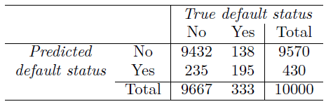

```{r setup, include=FALSE}
knitr::opts_chunk$set(echo = TRUE, message = FALSE, warning = FALSE)
library(ggplot2)
library(dplyr)
library(ISLR2)
library(pROC)
library(caret)
library(nhanesA)
library(klaR)  # Naive Bayes
```

## Classification

Classification is a statistical method for categorizing observations into discrete classes. Classification aims to predict a qualitative response for an observation, given one or more predictors. Classification can be used for inference as well as prediction. For example, medical researchers may want to know what symptoms or lifestyles are risk factors for a particular disease. A simpler model, like logistic regression, may be best for this use case, so we can have interpretable coefficients from our model.

Algorithms that implement classification are known as classifiers. Here are some common examples of classification problems and potentially appropriate classifiers.

### Examples of classification problems

1.  Predicting credit default given a balance (Logistic Regression)\
2.  Spam email detection (Naive Bayes)\
3.  Credit card fraud detection (Random Forest / Gradient Boosted Trees)\
4.  Diagnosing an arriving patient with a set of symptoms\
5.  Whether or not a passenger survived on the Titanic given demographic and ticket info\

### Some types of classifiers (less complex to more complex)

1.  Naive Bayes
2.  Logistic Regression
3.  K-Nearest Neighbors
4.  Decision Trees
5.  Boosted Trees
6.  Random Forest
7.  Neural Networks

#### Considerations for which model to use

1.  Interpretability: do we need to make sense of the model coefficients?
2.  Robustness: how robust the model is to variations and noise in the data
3.  Precision: accuracy, sensitivity, specificity
4.  Speed / ease of prediction

## Logistic Regression

There are many similarities in logistic regression to linear regression, so it's a natural classification model with which to start. Logistic Regression is a statistical method for modeling the relationship between one or more predictor variables and a binary response variable. Unlike linear regression, which predicts a continuous outcome, logistic regression predicts the probability of an event occurring, which we turn into a discrete classification using a cut-off value (typically 0.5)

### Linear Regression vs. Logistic Regression:

| Aspect              | Linear Regression                                                                                                                                                                                                                                           | Logistic Regression                                                                                                                                                                                                                                                                                                                                                                                 |
|--------------|----------------------|------------------------------------|
| **Nature**          | Predictive modeling technique for estimating the relationship between the dependent variable and one or more independent variables.                                                                                                                         | Predictive modeling technique used for binary classification.                                                                                                                                                                                                                                                                                                                                       |
| **Output**          | Continuous numeric value.                                                                                                                                                                                                                                   | Probability score between 0 and 1, which is used as a classifier given a cutoff value (typically 0.5).                                                                                                                                                                                                                                                                                              |
| **Use Cases**       | \- Suitable for predicting numeric and continuous outputs.<br>- E.g., predicting house prices, blood pressure, height, temperature.                                                                                                                         | \- Suitable for binary classification tasks, i.e., when the output variable is binary.<br>- E.g., email spam detection (spam or not spam), loan default prediction (default or not).                                                                                                                                                                                                                |
| **Equation**        | $y = \beta_0 + \beta_1 x_1 + \beta_2 x_2 + ... + \epsilon$                                                                                                                                                                                                  | $\log\left(\frac{p}{1-p}\right) = \beta_0 + \beta_1 x_1 + \beta_2 x_2 + ...$ where $p$ is the probability of the positive class.                                                                                                                                                                                                                                                                    |
| **Coefficients**    | \- Represent the mean change in the dependent variable for a one-unit change in the predictor, assuming all other predictors remain constant.<br>- Directly interpretable in terms of magnitude and direction.                                              | \- Represent the change in the log odds of the dependent variable for a one-unit change in the predictor.<br>- Exponentiating the coefficient gives the odds ratio.                                                                                                                                                                                                                                 |
| **Goodness of Fit** | -Residual Sum of Squares (RSS)<br>- $R^2$: Proportion of variance in the dependent variable predictable from independent variables.<br>- Residuals: Differences between observed and predicted values.<br>- F-statistic, p-values: Significance assessment. | \- Deviance: Analogous to residual sum of squares.<br>- McFadden's $R^2$: $1 - \frac{Deviance_{\text{mod}}}{Deviance_{null}}$<br>- AIC, BIC: Model selection metrics. Lower is better. Useful when comparing models and selecting features of the model.<br>- ROC Curve and AUC: Discriminative ability measure. AUC ranges from 0.5 (no discriminative power) to 1 (perfect discriminative power). |

### Parallels:

-   Both are linear models; they make predictions based on linear combinations of the predictors.
-   Both rely on the principle of maximum likelihood for estimation of their coefficients.
-   Regularization techniques like L1 (Lasso) and L2 (Ridge) can be applied to both to prevent overfitting and for feature selection.
-   Assumptions about linearity, multicollinearity, and independence of errors are considered in both types of regression.

While linear and logistic regression have parallels in their foundational techniques and linear nature, they cater to different types of prediction problems and yield different interpretations for their coefficients.

## Example: Probability of default given a credit card balance

```{r results='hide', message = FALSE}
data <- ISLR2::Default

# Convert Default to binary: 1 for "Yes" (defaulted), 0 for "No" (didn't default)
data$default <- ifelse(data$default == "Yes", 1, 0)

# Fit logistic regression
logit_model <- glm(default ~ balance, data=data, family="binomial")

# Fit linear regression
linear_model <- lm(default ~ balance, data=data)

# Predict probabilities
data$predicted_logit <- predict(logit_model, type="response")
data$predicted_linear <- predict(linear_model)
```

```{r}
# Logistic Model Results (Summary)
summary(logit_model)
```

```{r default logit example}
# Plot
ggplot(data, aes(x = balance, y = default)) +
  geom_jitter(alpha = 0.5, height = 0.05, size = .5) +
  geom_line(aes(y = predicted_logit, color = "Logistic Regression"), size = 2) +
  geom_line(aes(y = predicted_linear, color = "Linear Regression"), size = 2) +
  geom_smooth(aes(color = "geom_smooth")) + 
  labs(
    title = "Credit Card Balance vs. Probability of Default",
    y = "Probability of Default",
    x = "Credit Card Balance",
    color = "Model"
  ) +
  scale_y_continuous(limits = c(-0.05, 1.05), breaks = seq(0, 1, 0.1))
```

### When to Use Logistic Regression vs. Other Classification Methods

-   **Binary Outcome**: Logistic regression is ideal when your response variable is binary (e.g., Yes/No, 1/0, True/False).

-   **Linear Relationship**: Logistic regression assumes that the log odds of the response variable is a linear combination of the predictor variables. Does the logit function fit the data?

-   **Interpretability**: If you need to understand the influence of individual predictors, logistic regression offers clear coefficients for interpretation.

-   **Baseline Method**: Logistic regression is often used as a baseline against which more complex classifiers like decision trees, random forests, and gradient boosting machines are compared.

### Mathematics Behind Logistic Regression

The fundamental idea behind logistic regression is to model the log odds of an event using a linear combination of predictors. Mathematically:

$$ \log \left( \frac{p}{1-p} \right) = \beta_0 + \beta_1 X_1 + \beta_2 X_2 + ... + \beta_n X_n $$

Where:

-   $p$ is the probability of the event occurring.
-   $X_1, X_2, ..., X_n$ are the predictor variables.
-   $\beta_0, \beta_1, ..., \beta_n$ are the coefficients.

To get the probability $p$:

$$ p = \frac{e^{\beta_0 + \beta_1 X_1 + ... + \beta_n X_n}}{1 + e^{\beta_0 + \beta_1 X_1 + ... + \beta_n X_n}} $$

### Interpreting the Coefficients

To interpret the coefficients of a logistic regression:

-   **Intercept** $(\beta_0)$: The log odds of the event when all predictor variables are 0.

-   **For a Predictor** $(\beta_i)$: The change in log odds for a one-unit increase in the predictor variable. Specifically, if $\beta_i$ is the coefficient for predictor $X_i$, then $e^{\beta_i}$ is the odds ratio associated with a one-unit increase in $X_i$.

For example, if $\beta_i = 0.5$ for a predictor, then a one-unit increase in that predictor increases the odds of the event by $e^{0.5}$ or about 1.65 times.

To put this in terms of probability, let's use a hypothetical scenario:

Assume that, before the one-unit increase in $X$, the odds of the event occurring are 2:1. This translates to:

$$ P_{\text{base}} = \frac{2}{2+1} = \frac{2}{3} \approx 0.6667 $$

or 66.67%.

Now, after the one-unit increase in $X$, the odds become $1.65 \times 2 = 3.3$, or 3.3:1. The new probability, after the increase, becomes:

$$ P_{\text{new}} = \frac{3.3}{3.3+1} = \frac{3.3}{4.3} \approx 0.7674 $$

or 76.74%.

Therefore, in terms of probability, a one-unit increase in the predictor $X$ increases the likelihood of the event from 66.67% to 76.74%.

For our Model:

```{r}
# Extract coefficients from the logistic regression model
coefficients <- coef(logit_model)

# Convert log(odds) to odds
odds_intercept <- exp(coefficients["(Intercept)"])
odds_balance <- exp(coefficients["balance"])
cat("Coefficients:", coefficients, "\n")
odds_intercept
odds_balance
```

------------------------------------------------------------------------

## How good is our model?

To assess 'goodness' for a classification model, we use a Confusion Matrix.

<center></center>

**Type 1 Error:** You didn't default on your loan, but I predicted you would. You didn't have the disease, but I predicted you did. The null hypothesis really is true, but I rejected it.

**Type 2 Error:** You defaulted on your loan, but I predicted you wouldn't. It turns out you have the disease, and I missed it. The null hypothesis really is wrong, but I failed to reject it.

1.  **Accuracy**:
    -   **Definition**: Accuracy is the proportion of true results (both true positives and true negatives) in the population. It measures how often the classifier makes the correct prediction.
    -   **Explanation**: Out of 10000 borrowers, if your model correctly identifies 9000 borrowers (either as in default or not in default), then the accuracy is 90%.
2.  **Sensitivity (True Positive Rate)**:
    -   **Definition**: Sensitivity measures the proportion of actual positives that are correctly identified.
    -   **Explanation**: Of all the actual borrowers in default, how many did we correctly label as in default?
3.  **Specificity (True Negative Rate)**:
    -   **Definition**: Specificity measures the proportion of actual negatives that are correctly identified.
    -   **Explanation**: Of all the borrowers not in default, how many did we correctly label as not in default?
4.  **Kappa Value**:
    -   **Definition**: The Kappa statistic is a metric that compares the observed accuracy with the expected accuracy (random chance). Used to compare classification performance.

```{r}
# Using 0.5 as a threshold for classification
data$predicted_class <- ifelse(data$predicted_logit > 0.5, 1, 0)

# Generate confusion matrix
confusion <- confusionMatrix(as.factor(data$predicted_class), as.factor(data$default))
print(confusion)
```

```{r, message = FALSE}
# ROC curve
roc_obj <- roc(data$default, data$predicted_logit)

# Plot ROC curve
plot(roc_obj, main="ROC Curve", col="blue")
abline(h=0, v=1, lty=2) # Adds a dashed line

# AUC (Area Under the Curve)
cat("AUC:", auc(roc_obj), "\n")
```

5.  **AUC (Area Under the Curve)** We can also use an Receiver Operating Characteristics (ROC Curve) which depicts the tradeoffs in our model for specificity and sensitivity. The ideal curve "hugs" the top left and has an "Area Under the Curve" (AUC) of 1. This would indicate perfect prediction, correctly identifying all true positives without any false positives. The dashed line represents an AUC of 0.5, which is no better than random chance (no predictive power). In reality the AUC is less than 1 and the curve represents the tradeoff in predicting the true positives and not making any false positives.

Other goodness of fit measures:

```{r}
# Other goodness of fit measures
# Deviance
cat("Residual deviance:", logit_model$deviance, "\n")
cat("Null deviance:", logit_model$null.deviance, "\n")

# McFadden R-squared
mcfadden_rsquared <- 1 - (logit_model$deviance / logit_model$null.deviance)
cat("McFadden R-squared:", mcfadden_rsquared, "\n")
```

6.  **McFadden's R-squared**:
    -   **Definition**: It is a measure that compares the likelihood of our model to the likelihood of a null model (a model with no predictors). Used to explain level of model's explanatory power.
    -   **Explanation**: It's akin to saying, "Here's how much better our model is compared to making predictions without any information." An R-squared value close to 1 suggests our model is close to perfect, while a value close to 0 suggests our model is no better than the null model.
7.  **Residual Deviance**:
    -   **Definition**: It represents the lack of fit of our model to the data. A smaller deviance indicates a better fit.
    -   **Explanation**: Think of this as a measure of "how off" our predictions are from the actual outcomes. Smaller values are better.
8.  **Null Deviance**:
    -   **Definition**: It represents the difference between a model with no predictors and the actual data.
    -   **Explanation**: This is our baseline "badness of fit" before any predictors are added. It gives context to the residual deviance---how much our model improves the fit compared to not modeling at all.

## Naive Bayes Classification

Naive Bayes is a probabilistic classification method based on applying Bayes' theorem with strong (naïve) independence assumptions. We're assuming, each feature makes an independent and equal contribution to the outcome.

### Overview:

Naive Bayes classifier calculates the probabilities for every factor. Then, it selects the outcome with the highest probability. This approach works particularly well when the dimensionality of the inputs is high.

Given a class variable $y$ and a dependent feature vector $\mathbf{x} = (x_1, x_2, \dots, x_n)$, Bayes' theorem states:

$$ P(y|\mathbf{x}) = \frac{P(\mathbf{x}|y)P(y)}{P(\mathbf{x})} $$

Where: - $P(y|\mathbf{x})$ is the posterior probability of class $y$ given predictor vector $\mathbf{x}$. - $P(y)$ is the prior probability of class $y$. - $P(\mathbf{x}|y)$ is the likelihood which is the probability of predictor $\mathbf{x}$ given class $y$. - $P(\mathbf{x})$ is the prior probability of predictor $\mathbf{x}$.

### **Advantages and Disadvantages:**

| **Aspect**        | **Description**                                                                                                                                                                                                                             |
|-------------|-----------------------------------------------------------|
| **Advantages**    | \- Requires a small amount of training data.\<br\>- Fast and efficient.\<br\>- Not sensitive to irrelevant features.\<br\>- Performs well in multi-class prediction.                                                                        |
| **Disadvantages** | \- Assumes that all predictors are independent, which is rarely the case.\<br\>- It can't learn interactions between features.\<br\>- For continuous features, a normal distribution is assumed (can be addressed by using discretization). |
| **Use Cases**     | \- Text classification (e.g., spam detection).\<br\>- Document categorization.\<br\>- Sentiment analysis.\<br\>- Recommender systems.                                                                                                       |

### Example: Text Classification for Spam Detection

Imagine you have email data and you want to classify whether an email is spam or not based on its content.

The vocabulary (or words that could be used) is: "FREE", "OFFER", "REVIEW", "NOW".

Given a training data set of spam and non-spam emails, you can determine probabilities such as $P(\text{"FREE"}|\text{Spam})$ -- the probability that the word "FREE" appears given that this is a Spam email.

Let's say a new email comes in with the text "FREE OFFER". The Naive Bayes classifier, considering each word independently, calculates the probability that this email is spam based on the probabilities of seeing each word in spam emails from the training dataset.

## When to Use Naive Bayes vs. Other Classification Methods

-   **Text Data**: Naive Bayes is a popular choice for text classification tasks, such as spam detection or sentiment analysis.
-   **Naive Assumption**: If you have reasons to believe that your features are conditionally independent given the output class, then Naive Bayes might be a good choice.
-   **Multiclass Problems**: It supports multiclass classification.
-   **Baseline Method**: Due to its simplicity and efficiency, it's often used as a baseline in more complex modeling exercises.

### Mathematics Behind Naive Bayes

Given a data point $\mathbf{x}$, the goal is to compute the posterior probability $P(y|\mathbf{x})$ for all classes $y$. The class with the highest posterior probability is the prediction.

$$ P(y|\mathbf{x}) \propto P(y) \prod_{i=1}^{n} P(x_i|y) $$

Here: - $P(y)$ is the prior probability of class $y$. - $P(x_i|y)$ is the likelihood of feature $x_i$ given class $y$. - $n$ is the number of features.

### Interpreting the Results

To interpret the results of a Naive Bayes classifier: - **Prior Probability** $P(y)$: This represents our initial beliefs before seeing the features. For example, if 60% of our training emails are spam, then $P(\text{Spam}) = 0.6$. - **Likelihood** $P(\mathbf{x}|y)$: This represents the probability of observing the features given a class. In our email example, the likelihood $P(\text{"FREE"}|\text{Spam})$ might be 0.05, representing a 5% chance of seeing the word "FREE" in a spam email. - **Posterior Probability** $P(y|\mathbf{x})$: After observing the features, this represents our updated belief about the class. The class with the highest posterior probability becomes our prediction.

```{r}
# Simulating data
n <- 100
x1 <- rnorm(n, mean = 3, sd = 1)
x2 <- rnorm(n, mean = x1, sd = 1)
class <- ifelse(x1 + x2 > 8, "A", "B")

df <- data.frame(x1, x2, class)

# Plotting data with decision boundary
library(ggplot2)
ggplot(df, aes(x = x1, y = x2, color = class)) +
  geom_point() +
  geom_abline(intercept = 8, slope = -1, linetype = "dashed") +
  labs(title = "Naive Bayes Example")
```

## K-Nearest Neighbors (K-NN) Classification

K-Nearest Neighbors (K-NN) is a non-parametric, instance-based supervised learning algorithm used for classification and regression. It classifies objects based on the majority class of their K nearest neighbors in the training set.

### Overview:

Given a new observation, K-NN searches the training set for the K instances that are closest to the observation. For classification, the output is the class that has the majority among the K neighbors.

The distance between instances can be measured using various methods, the most common being the Euclidean distance:

$$ d(\mathbf{p}, \mathbf{q}) = \sqrt{(p_1 - q_1)^2 + (p_2 - q_2)^2 + \dots + (p_n - q_n)^2} $$

Where: - $\mathbf{p}$ and $\mathbf{q}$ are two points in the feature space. - $n$ is the number of dimensions (features).

### Advantages:

-   Simple to implement and understand.
-   Training phase is fast as it just stores the training data.
-   Can learn complex decision boundaries.
-   Naturally handles multi-class problems.

### Example: Handwritten Digit Recognition

Imagine you have a dataset of handwritten digits (0 through 9) and you want to classify a new handwritten digit based on its similarity to the existing ones.

For a given new digit image, K-NN would look for K images from the training set that are most similar (or "closest") to the new image. Then, the new digit would be classified based on the majority label among these K neighbors.

## When to Use K-NN vs. Other Classification Methods:

-   **Small Dataset**: K-NN can be computationally expensive and slow on large datasets.
-   **Low Dimensionality**: Works best when the number of features (dimensions) isn't too high, as the "curse of dimensionality" can hinder its performance.
-   **Instance-Based Learning**: When it's useful to make local approximations using a small number of instances.
-   **Baseline Method**: Due to its simplicity, it can serve as a baseline before using more complex classifiers.

### Mathematics Behind K-NN:

Given a data point $\mathbf{x}$, the goal is to identify the K nearest points in the training set. The prediction $\hat{y}$ is then based on a majority vote (for classification) or an average (for regression) among the K neighbors.

$$ \hat{y}(\mathbf{x}) = \frac{1}{K} \sum_{i \in N_k(\mathbf{x})} y_i $$

Where: - $N_k(\mathbf{x})$ represents the K nearest neighbors of $\mathbf{x}$ in the training data. - $y_i$ is the output value for the $i^{th}$ neighbor.

### Interpreting the Results:

In K-NN: - **Choice of K**: The value of K can greatly influence the performance. A small K can be noisy and sensitive to outliers, while a large K can smooth out decision boundaries too much. - **Distance Metric**: The choice of distance metric (e.g., Euclidean, Manhattan, Minkowski) can affect the results. It's essential to choose a metric that makes sense for the data. - **Weighted K-NN**: Weights can be given to neighbor points based on their distance to the new point. Closer neighbors can have a larger influence on the prediction.

```{r}
# Simulating data
n <- 100
x1 <- runif(n, 0, 5)
x2 <- runif(n, 0, 5)
class <- ifelse((x1 - 2.5)^2 + (x2 - 2.5)^2 < 2, "A", "B")

df <- data.frame(x1, x2, class)

# New instance
new_x1 <- 3
new_x2 <- 3

# Plotting data with new instance
ggplot(df, aes(x = x1, y = x2, color = class)) +
  geom_point() +
  geom_point(aes(x = new_x1, y = new_x2), color = "black", size = 3) +
  annotate("text", x = new_x1, y = new_x2 + 0.2, label = "New Point") +
  labs(title = "K-NN Example")

```

## Classification with Diabetes Data Set

This diabetes data set contains various health indicators and the presence or absence of diabetes. Dataset taken from Kaggle: <https://www.kaggle.com/datasets/akshaydattatraykhare/diabetes-dataset> Let's classify whether a patient has diabetes based on other health indicators.

```{r}
d <- read.csv("diabetes.csv")
d$Outcome <- as.factor(d$Outcome)
mod <- glm(Outcome~., family="binomial", data=d)
summary(mod)

# Convert coefficients to odds:
coeffs <- coef(mod)

# Convert log(odds) to odds
coeffs_odds <- exp(coeffs)
coeffs_odds

# Predict probabilities
d$prediction <- predict(mod, type="response")

# Using 0.5 as a threshold for classification
d$predicted_class <- ifelse(d$prediction > 0.5, 1, 0)

# Generate confusion matrix
confusion <- confusionMatrix(as.factor(d$predicted_class), as.factor(d$Outcome))
print(confusion)

roc_obj <- roc(d$Outcome, d$prediction)

# Plot ROC curve
plot(roc_obj, main="ROC Curve", col="blue")
abline(h=0, v=1, lty=2) # Adds a dashed line

# AUC (Area Under the Curve)
cat("AUC:", auc(roc_obj), "\n")
```

Let's try it again, removing "SkinThickness"

```{r}
rm(d, mod)
d <- read.csv("diabetes.csv")

d$Outcome <- as.factor(d$Outcome)

mod <- glm(Outcome~.-SkinThickness, family="binomial", data=d)
summary(mod)

# Convert coefficients to odds:
coeffs <- coef(mod)

# Convert log(odds) to odds
coeffs_odds <- exp(coeffs)
coeffs_odds

# Naive Bayes Model:
# mod_bayes <- klaR::NaiveBayes(Outcome~.-SkinThickness, data = d)

# Predict probabilities
d$prediction <- predict(mod, type="response")

# Using 0.5 as a threshold for classification
d$predicted_class <- ifelse(d$prediction > 0.5, 1, 0)

# Generate confusion matrix
confusion <- confusionMatrix(as.factor(d$predicted_class), as.factor(d$Outcome))
print(confusion)

roc_obj <- roc(d$Outcome, d$prediction)

# Plot ROC curve
plot(roc_obj, main="ROC Curve", col="blue")
abline(h=0, v=1, lty=2) # Adds a dashed line

# AUC (Area Under the Curve)
cat("AUC:", auc(roc_obj), "\n")
```
